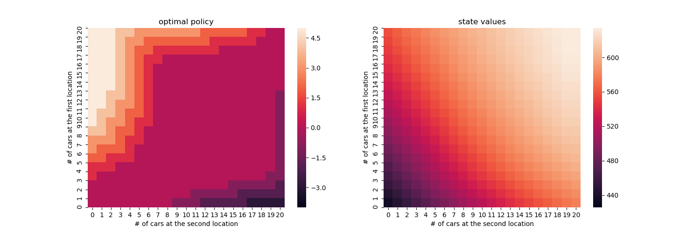

# reinforcement-learning-an-introduction--exercises

## Dynamic programming: car rental problem

Although dynamic programming is not reinforcement learning, it bears a lot of resemblence.
Still it requires a full model of the environment and a lot of computation.

Dynamic programming was used here to solve jack's car rental problem as described in 'reinforcement learning an introduction' by Sutton and Barto.

## Cartpole balancing 

Open AI gym was used as simulation environment for balancing a cartpole.

Using reinforcement learning (Q-learning, off-policy) with a tabular approach the following control scheme was achieved
after 100000 episodes of training.

